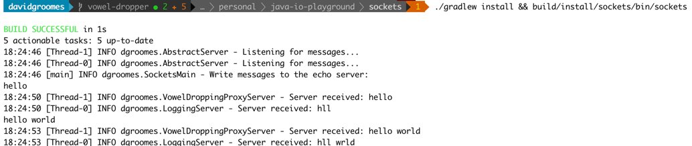

# sockets

A simple "write and listen" program using sockets.

## Pre-requisites

* Java 16 must be installed
    * The program depends on this version. It is specified in the `build.gradle.kts` file using the `java` configuration
      block which implements
      Gradle's [Toolchains for JVM projects feature](https://docs.gradle.org/current/userguide/toolchains.html).

## Instructions

1. Use Java 8 or higher
    * Note: Gradle depends on this version of Java or higher
1. Build the program:
    * `./gradlew install`
1. Run it:
    * `build/install/sockets/bin/sockets`
1. Write a message
    * Write a message in the terminal.
    * You should see that same message logged by the server!
    * It will look something like this:
    
