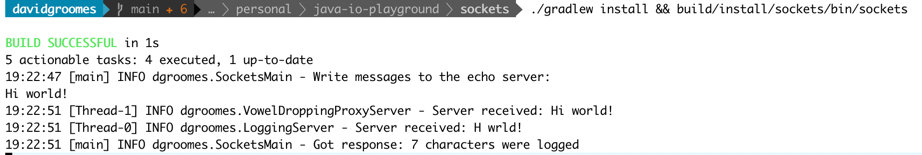

# sockets

A simple client and server program using sockets.

## Instructions

Follow these instructions to build and run the program.

1. Use Java 17
1. Build the program:
    * `./gradlew install`
1. Run it:
    * `build/install/sockets/bin/sockets`
1. Write a message
    * Write a message in the terminal.
    * You should see that message logged by the servers!
    * It will look something like this:
      

## Wish list

General clean ups, TODOs and things I wish to implement for this project:

* DONE Create an intermediate process listener, or "forwarder", between the client and LoggingServer that drops vowels
* Periodically fail on the server side. (I'm not sure how to do this; but I want to simulate failure and retries) 
  * DONE First, implement a proper class to abstract the client. This class will later be extended with retry logic.
* Can the base abstract server use bytes instead of a buffered reader to be more generic?
* DONE Send data from the server back to the client
